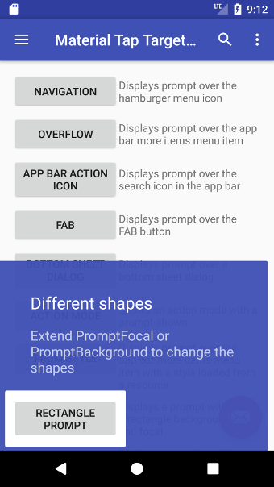

```groovy
dependencies {
    implementation 'com.agesa.showcase_new:showcase_new:1.0.0'
}
```
Supports Android minSdkVersion 21

Version 2.15.0 works with Android Support Library


## Usage
Basic usage is shown below with more examples in the 

```java
new MaterialTapTargetPrompt.Builder(MainActivity.this)
        .setTarget(R.id.fab)
        .setPrimaryText("Send your first email")
        .setSecondaryText("Tap the envelope to start composing your first email")
        .setPromptStateChangeListener(new MaterialTapTargetPrompt.PromptStateChangeListener()
        {
            @Override
            public void onPromptStateChanged(MaterialTapTargetPrompt prompt, int state)
            {
                if (state == MaterialTapTargetPrompt.STATE_FOCAL_PRESSED)
                {
                    // User has pressed the prompt target
                }
            }
        })
        .show();
```

### Note

If a target is not set or the target view could not be found or both the primary and secondary text are `null` then `builder.show` and `builder.create` will return `null`.

# Other shapes

The default shape is a circle but any other shape can be rendered by extending the [PromptBackground][6] and [PromptFocal][7] classes.
Custom shapes such as a rectangle can be set by calling `setPromptBackground` and/or `setPromptFocal`.
Documentation and examples are available [here][8].



# License
    Copyright (C) 2016-2021 Samuel Wall

    Licensed under the Apache License, Version 2.0 (the "License");
    you may not use this file except in compliance with the License.
    You may obtain a copy of the License at

    http://www.apache.org/licenses/LICENSE-2.0

    Unless required by applicable law or agreed to in writing, software
    distributed under the License is distributed on an "AS IS" BASIS,
    WITHOUT WARRANTIES OR CONDITIONS OF ANY KIND, either express or implied.
    See the License for the specific language governing permissions and
    limitations under the License.

[2]: https://github.com/sjwall/MaterialTapTargetPrompt/tree/master/sample/src/main/java/uk/co/samuelwall/materialtaptargetprompt/sample
[3]: https://sjwall.github.io/MaterialTapTargetPrompt/examples
[5]: https://play.google.com/store/apps/details?id=com.agesa.showcase_new.sample&utm_source=global_co&utm_medium=prtnr&utm_content=Mar2515&utm_campaign=PartBadge&pcampaignid=MKT-Other-global-all-co-prtnr-py-PartBadge-Mar2515-1
[6]: https://github.com/sjwall/MaterialTapTargetPrompt/blob/master/library/src/main/java/uk/co/samuelwall/materialtaptargetprompt/extras/PromptBackground.java
[7]: https://github.com/sjwall/MaterialTapTargetPrompt/blob/master/library/src/main/java/uk/co/samuelwall/materialtaptargetprompt/extras/PromptFocal.java
[8]: https://sjwall.github.io/MaterialTapTargetPrompt/shapes
